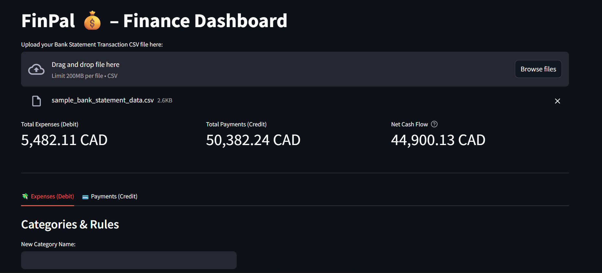
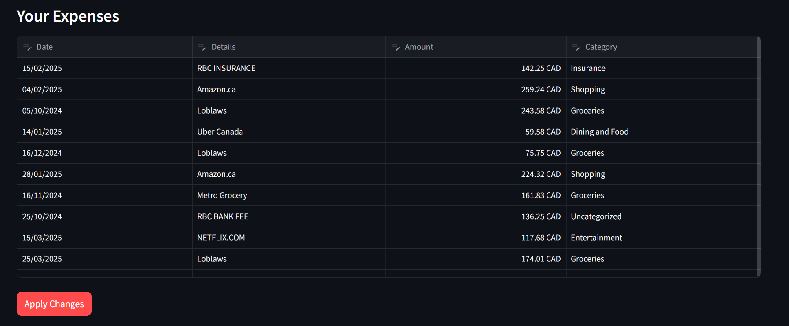
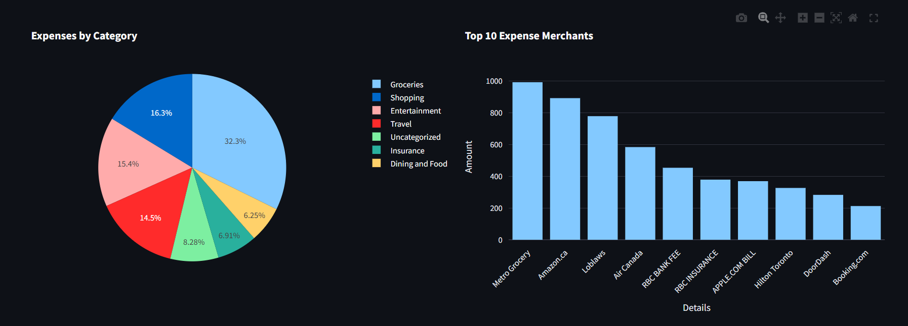

# **FinPal – Finance Dashboard** 💰📊
*A personal finance visualization tool built with Streamlit.*

FinPal is an interactive finance dashboard that helps users upload their bank statements, categorize expenses, and view insights into their spending behavior.  
Designed with clarity and ease of use in mind, FinPal turns raw financial data into meaningful visual analytics.

---

## 🚀 **Features**

### **📥 Upload Transactions**
- Upload any CSV bank statement (Date, Details, Amount, Debit/Credit)
- Automatic cleaning and formatting of data

### **🏷 Custom Categorization**
- Add your own spending categories
- Assign keywords for automated future categorization
- Edit category assignments directly in the dashboard

### **💸 Expense Insights**
- Total spending (Debits) and total income (Credits)
- Category-level spending breakdown
- Top merchants by spending
- Daily and monthly expense trends
- Stacked monthly category spending chart

### **💳 Payments Overview**
- Total monthly income/payments
- Daily payment trends
- Clean transaction visualization for credits

### **📊 Interactive Visualizations**
- **Pie Charts** – Expense distribution by category  
- **Bar Charts** – Top merchants, category spending  
- **Line Charts** – Daily expenses & payments  
- All charts powered by Plotly for interactivity

---

## **🏦 Example of Sample Bank Statement Data**




---

## 🛠 **Tech Stack**

| Component        | Technology |
|------------------|------------|
| UI               | Streamlit |
| Data Processing  | Pandas |
| Visualizations   | Plotly Express |
| Storage          | Local JSON (categories) |
| State Handling   | Streamlit Session State |

---

## 📥 **How to Run FinPal**

### 1. Clone the Repository
```bash
git clone https://github.com/yourusername/finpal-dashboard.git
cd finpal-dashboard
```
### 2. Create a Virtual Environment
```bash
python -m venv .venv
```
Windows:
```bash
.venv\Scripts\activate
```
### 3. Install Dependencies
```bash
pip install -r requirements.txt
```
### 4. Run the App
```bash
streamlit run app.py
```
When asked to upload a CSV, you can choose the sample bank statement data:

📁 **[Sample Bank Statement Data](sample_bank_statement_data.csv)**

---

## 🤝 **Contributions**
Contributions and suggestions are welcome!
Feel free to open issues or submit pull requests.
